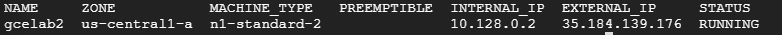
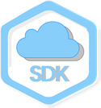

Getting Started with Cloud Shell & gcloud
=========================================

- Overview
- Start Cloud Shell
- Understanding Regions and Zones
- Initializing Cloud SDK
- Setting environment variables
- Create a virtual machine with gcloud
- Using gcloud commands
- Auto-completion
- SSH into your vm instance
- Use the Home directory

Overview
--------

Google Cloud Shell provides you with `gcloud` command-line access to
computing resources hosted on the Google Cloud Platform. Cloud Shell is
a Debian-based virtual machine with a persistent 5GB home directory,
which makes it easy for you to manage your GCP projects and resources.
The Cloud SDK `gcloud` and other utilities you need come pre-installed
in Cloud Shell, which allows you to get up and running quickly.

In this hands-on lab you will learn how to connect to computing
resources hosted on the Google Cloud Platform via Cloud Shell with the
`gcloud` command-line.

Students are encouraged to type the commands themselves, which
reinforces the core concepts. Many labs will include a code block that
contains the required commands. You can easily copy and paste the
commands from the code block into the appropriate places during the lab.

### What you'll do

-   Practice using `gcloud` commands.
-   Connect to compute services hosted on the Google Cloud Platform.

### Prerequisites

-   Familiarity with standard Linux text editors such as `vim`, `emacs`,
    or `nano.`

Setup
-----

#### What you need

To complete this lab, you need:

-   Access to a standard internet browser (Chrome browser recommended).
-   Time to complete the lab.

***Note:*** If you already have your own personal GCP account or
project, do not use it for this lab.

#### How to start your lab and sign in to the Console

-   Open https://console.cloud.google.com/
-   Enter login credentials

After a few moments, the GCP console opens in this tab.

**Note:** You can view the menu with a list of GCP Products and Services
by clicking the **Navigation menu** at the top-left, next to “Google
Cloud Platform”. 

Start Cloud Shell
-----------------

Open a Cloud Shell session by clicking on the icon in the top right
corner of the GCP Console:

Then Start Cloud Shell:

After Cloud Shell is activated you can use the command line to invoke
the Cloud SDK `gcloud` command or other tools available on the virtual
machine instance. Later in the lab you will use your `$HOME` directory,
which is used in persistent disk storage to store files across projects
and between Cloud Shell sessions. Your `$HOME` directory is private to
you and cannot be accessed by other users.

Understanding Regions and Zones
-------------------------------

Certain Compute Engine resources live in regions or zones. A region is a
specific geographical location where you can run your resources. Each
region has one or more zones. For example, the us-central1 region
denotes a region in the Central United States that has zones
`us-central1-a`, `us-central1-b`, `us-central1-c`, and `us-central1-f`.

Resources that live in a zone are referred to as zonal resources.
Virtual machine Instances and persistent disks live in a zone. To attach
a persistent disk to a virtual machine instance, both resources must be
in the same zone. Similarly, if you want to assign a static IP address
to an instance, the instance must be in the same region as the static
IP.

Learn more about regions and zones and see a complete list in [Regions &
Zones
documentation](https://cloud.google.com/compute/docs/regions-zones/).

Default regions and zones are set by using the following values:

`google-compute-default-zone` `google-compute-default-region`

To see what your default region and zone settings are, run the following
`gcloud` command, replacing \<your\_project\_id\> which you can see on
the Home page in the Console with your Project ID:

    gcloud compute project-info describe --project <your_project_ID>

You'll use the zone (`google-compute-default-zone`) from the output
later in this lab.

Look for the default zone and region metadata values in the response. If
the `google-compute-default-region` and `google-compute-default-zone`
keys and values are missing from the response, that means no default
zone or region is set.

Initializing Cloud SDK
----------------------

The `gcloud` CLI is a part of the Google Cloud SDK. You need to download
and install the SDK on your own system and initialize it (by running
`gcloud init`) before you can use the `gcloud` command-line tool.

The `gcloud` CLI is automatically available in Cloud Shell. Since you're
using Cloud Shell for this lab, you don't need to install `gcloud`
manually.

Setting environment variables
-----------------------------

Environment variables are variables that define your environment. Define
your own variables and save yourself time when writing scripts that
contain APIs or executables.

Make a couple of environment variables:

    export PROJECT_ID=<your_project_ID>

Set your ZONE environment variable (use the value for zone from the
earlier command):

    export ZONE=<your_zone>

Verify that your variables were set properly:

    echo $PROJECT_ID
    echo $ZONE

Create a virtual machine with gcloud
------------------------------------

Create a new virtual machine instance using `gcloud`. In the following
command you'll use:

-   `gcloud compute` which enables you to easily manage your Google
    Compute Engine resources in a friendlier format than using the
    Compute Engine API.
-   `instances create` creates a new instance.

Run the following to create your vm:

    gcloud compute instances create gcelab2 --machine-type n1-standard-2 --zone $ZONE

-   The name of the vm is "gcelab2",
-   You're using the `--machine-type` flag to specify the machine type
    as "n1-standard-2"
-   You're using the `--zone` flag to specify that it gets created in
    the zone you defined with your environment variable.

(Output)

If you omit the `--zone` flag, `gcloud` can infer your desired zone
based on your default properties. Other required instance settings, like
`machine type` and `image`, if not specified in the create command, are
set to default values.

#### Test Completed Task

Click **Check my progress** to verify your performed task. If you have
successfully created a virtual machine with gcloud, you will see an
assessment score.

Create a virtual machine with gcloud

You can see the default values by displaying help for the `create`
command:

    gcloud compute instances create --help

Using gcloud commands
---------------------

`gcloud` offers simple usage guidelines that are available by adding the
`-h` flag (for help) onto the end of any `gcloud` invocation.

Run the following command in Cloud Shell:

    gcloud -h

More verbose help can be obtained by appending `--help` flag, or
executing `gcloud help` command. Run the following in Cloud Shell:

    gcloud config --help

Use the **Enter** key or the **Spacebar** to scroll through the help
content.

Type `q` to exit the content.

Now run the following command:

    gcloud help config

You can see that the `gcloud config --help` and `gcloud help config`
commands are equivalent. Both give long, detailed help.

[`gcloud` Global Flags](https://cloud.google.com/sdk/gcloud/reference/)
govern the behavior of commands on a per-invocation level. Flags
override any values set in SDK properties.

View the list of configurations in your environment:

    gcloud config list

To check how other properties are set, see all properties by calling:

    gcloud config list --all

List your `components`:

    gcloud components list

Here you will see what components are ready for you to use in this lab.
Next you'll install a new component.

Auto-completion
---------------

`gcloud interactive` has auto prompting for commands and flags, and
displays inline help snippets in the lower section as the command is
typed.

Static information, like command and sub-command names, and flag names
and enumerated flag values, are auto-completed using dropdown menus.

Install the beta components:

    gcloud components install beta

Enter the `gcloud interactive` mode:

    gcloud beta interactive

When using the interactive mode, click on the **Tab** key to complete
file path and resource arguments. If a dropdown menu appears, use the
**Tab** key to move through the list, and the **Space bar** to select
your choice.

Try it out! Start typing the following command, using auto-complete to
finish the command:

    gcloud compute instances describe <your_vm>

Across the bottom of Cloud Shell you can see the shortcut to toggle this
feature. Try out the F2 toggle:

F2:help:STATE Toggles the active help section, ON when enabled, OFF when
disabled.

SSH into your vm instance
-------------------------

`gcloud compute` makes connecting to your instances easy. The
`gcloud compute ssh` command provides a wrapper around SSH, which takes
care of authentication and the mapping of instance name to IP address.

Use `gcloud compute ssh` to SSH into your vm:

    gcloud compute ssh gcelab2 --zone $ZONE

(Output)

    WARNING: The public SSH key file for gcloud does not exist.
    WARNING: The private SSH key file for gcloud does not exist.
    WARNING: You do not have an SSH key for gcloud.
    WARNING: [/usr/bin/ssh-keygen] will be executed to generate a key.
    This tool needs to create the directory
    [/home/gcpstaging306_student/.ssh] before being able to generate SSH Keys.

Type "Y" to continue:

    Do you want to continue? (Y/n)

Press the **Enter** key through the passphrase section to leave the
passphrase empty.

    Generating public/private rsa key pair.
    Enter passphrase (empty for no passphrase)

You don't need to do anything here, so disconnect from SSH by exiting
from the remote shell by typing "exit":

    exit

You should be back at your project's command prompt.

Use the Home directory
----------------------

Now try out your Home directory. The contents of your Cloud Shell Home
directory persists across projects between all Cloud Shell sessions,
even after the virtual machine terminates and is restarted.

Change your current working directory:

    cd $HOME

Open your `.bashrc` configuration file using `vi` text editor:

    vi ./.bashrc

The editor opens and displays the contents of the file. Press the `ESC`
key and then `:wq` to exit the editor.

Test your Understanding
-----------------------

Below is a multiple choice question to reinforce your understanding of
this lab's concepts. Answer to the best of your abilities.

Congratulations!
----------------

You learned how to launch Cloud Shell and ran some sample `gcloud`
commands.

### Next steps / Learn More

-   Cloud Shell [Documentation](https://cloud.google.com/shell/docs/)
    and [tutorial video](https://www.youtube.com/watch?v=hBMcAKzGt3w).
-   `gcloud` [Documentation](https://cloud.google.com/sdk/gcloud/) and
    [tutorial
    video](https://www.youtube.com/watch?v=oTIK9OvQBxQ&list=PLIivdWyY5sqIij_cgINUHZDMnGjVx3rxi&index=15).
