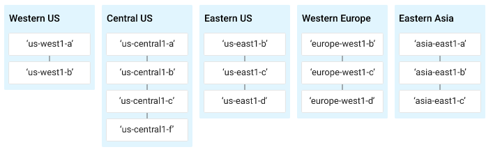

Creating a Virtual Machine
==========================

Overview
--------

Google Compute Engine lets you create virtual machines running different
operating systems, including multiple flavors of Linux (Debian, Ubuntu,
Suse, Red Hat, CoreOS) and Windows Server, on Google infrastructure. You
can run thousands of virtual CPUs on a system that has been designed to
be fast and to offer strong consistency of performance.

In this hands-on lab you'll learn how to create virtual machine
instances of various machine types using the Google Cloud Platform (GCP)
Console and using the `gcloud` command line. You'll also learn how to
connect an NGINX web server to your virtual machine.

Although you can easily copy and paste commands from the lab to the
appropriate place, students should type the commands themselves to
reinforce their understanding of the core concepts

#### What you'll do

-   Create a virtual machine with the GCP Console
-   Create a virtual machine with `gcloud` command line
-   Deploy a web server and connect it to a virtual machine

### Prerequisites

-   Familiarity with standard Linux text editors such as `vim`, `emacs`,
    or `nano` will be helpful

#### What you need

To complete this lab, you need:

-   Access to a standard internet browser (Chrome browser recommended).
-   Time to complete the lab.

#### How to start your lab and sign in to the Console

-   Open https://console.cloud.google.com/
-   Enter login credentials

After a few moments, the GCP console opens in this tab.

**Note:** You can view the menu with a list of GCP Products and Services
by clicking the **Navigation menu** at the top-left, next to “Google
Cloud Platform”. 

### Activate Google Cloud Shell

Google Cloud Shell is a virtual machine that is loaded with development
tools. It offers a persistent 5GB home directory and runs on the Google
Cloud. Google Cloud Shell provides command-line access to your GCP
resources.

1.  In GCP console, on the top right toolbar, click the Open Cloud Shell
    button.

    

2.  Click **Continue**.
    

It takes a few moments to provision and connect to the environment. When
you are connected, you are already authenticated, and the project is set
to your *PROJECT\_ID*. For example:

**gcloud** is the command-line tool for Google Cloud Platform. It comes
pre-installed on Cloud Shell and supports tab-completion.

You can list the active account name with this command:

    gcloud auth list

Output:

    Credentialed accounts:
     - <myaccount>@<mydomain>.com (active)

Example output:

    Credentialed accounts:
     - google1623327_student@testlabs.net

You can list the project ID with this command:

    gcloud config list project

Output:

    [core]
    project = <project_ID>

Example output:

    [core]
    project = testlabs-gcp-44776a13dea667a6

Full documentation of **gcloud** is available on [Google Cloud gcloud
Overview](https://cloud.google.com/sdk/gcloud).

### Understanding Regions and Zones

Certain Compute Engine resources live in regions or zones. A region is a
specific geographical location where you can run your resources. Each
region has one or more zones. For example, the us-central1 region
denotes a region in the Central United States that has zones
`us-central1-a`, `us-central1-b`, `us-central1-c`, and `us-central1-f`.

Resources that live in a zone are referred to as zonal resources.
Virtual machine Instances and persistent disks live in a zone. To attach
a persistent disk to a virtual machine instance, both resources must be
in the same zone. Similarly, if you want to assign a static IP address
to an instance, the instance must be in the same region as the static
IP.

Learn more about regions and zones and see a complete list in [Regions &
Zones
documentation](https://cloud.google.com/compute/docs/regions-zones/).

Create a new instance from the Cloud Console
--------------------------------------------

In this section, you'll learn how to create new pre-defined machine
types with Google Compute Engine from the Cloud Console.

In the GCP Console, on the top left of the screen, select **Navigation
menu** \> **Compute Engine** \> **VM Instances**:

This may take a minute to initialize for the first time.

To create a new instance, click **Create**.

There are many parameters you can configure when creating a new
instance. Use the following for this lab:

Field

Value

Additional Information

**Name**

`gcelab`

Name for the VM instance

**Region**

`us-central1 (Iowa)`

or

`asia-south1 (Mumbai)`

Learn more about regions in [Regions & Zones
documentation](https://cloud.google.com/compute/docs/zones).

**Zone**

`us-central1-c `

or

`asia-south1-c`

**Note:**remember the zone that you selected, you'll need it later.

Learn more about zones in [Regions & Zones
documentation](https://cloud.google.com/compute/docs/zones).

**Machine Type**

`2 vCPUs`

This is a (n1-standard-2),

2-CPU, 7.5GB RAM instance.

There are a number of machine types, ranging from micro instance types
to 32-core/208GB RAM instance types. Learn more in the [Machine Types
documentation](https://cloud.google.com/compute/docs/machine-types).

**Note**: A new project has a default [resource
quota](https://cloud.google.com/compute/docs/resource-quotas), which may
limit the number of CPU cores. You can request more when you work on
projects outside of this lab.

**Boot Disk**

`New 10 GB standard persistent disk`

`OS Image: Debian GNU/Linux 9 (stretch)`

There are a number of images to choose from, including: Debian, Ubuntu,
CoreOS as well as premium images such as Red Hat Enterprise Linux and
Windows Server. See Operating System documentation for more detail.

**Firewall**

Check `Allow HTTP traffic`

Check this option so to access a webserver that you'll install later.

**Note:**This will automatically create firewall rule to allow HTTP
traffic on port 80.

Click **Create**.

Wait for it to finish - it shouldn't take more than a minute.

Once finished, you should see the new virtual machine in the **VM
Instances** page.

To SSH into the virtual machine, click on **SSH** on the right hand
side. This launches a SSH client directly from your browser.

**Note:** For more information, see the [Connect to an instance using
ssh
documentation](https://cloud.google.com/compute/docs/instances/connecting-to-instance).

### Install a NGINX web server

Now you'll install NGINX web server, one of the most popular web servers
in the world, to connect your virtual machine to something.

Once SSH'ed, get `root` access using `sudo`:

    sudo su -

As the `root` user, update your OS:

    apt-get update

(Output)

    Get:1 http://security.debian.org stretch/updates InRelease [94.3 kB]
    Ign http://deb.debian.org strech InRelease
    Get:2 http://deb.debian.org strech-updates InRelease [91.0 kB]
    ...

Install NGINX:

    apt-get install nginx -y

(Output)

    Reading package lists... Done
    Building dependency tree
    Reading state information... Done
    The following additional packages will be installed:
    ...

Check that NGINX is running:

    ps auwx | grep nginx

(Output)

    root      2330  0.0  0.0 159532  1628 ?        Ss   14:06   0:00 nginx: master process /usr/sbin/nginx -g daemon on; master_process on;
    www-data  2331  0.0  0.0 159864  3204 ?        S    14:06   0:00 nginx: worker process
    www-data  2332  0.0  0.0 159864  3204 ?        S    14:06   0:00 nginx: worker process
    root      2342  0.0  0.0  12780   988 pts/0    S+   14:07   0:00 grep nginx

Awesome! To see the web page, go to the Cloud Console and click the
`External IP` link of the virtual machine instance. You can also see the
web page by adding the `External IP` to `http://EXTERNAL_IP/` in a new
browser window or tab.

You should see this default web page:

To check your progress in this lab, click **Check my progress** below. A
checkmark means you're on track.

Create a Compute Engine instance and add Nginx Server to your instance
with necessary firewall rules.

Create a new instance with gcloud
---------------------------------

Rather than using the GCP Console to create a virtual machine instance,
you can use the command line tool `gcloud`, which is pre-installed in
[Google Cloud
Shell](https://cloud.google.com/developer-shell/#how_do_i_get_started).
Cloud Shell is a Debian-based virtual machine loaded with all the
development tools you'll need (`gcloud`, `git,` and others) and offers a
persistent 5GB home directory.

If you want to try this on your own machine in the future, read the
[gcloud command line tool guide](https://cloud.google.com/sdk/gcloud/).

In the Cloud Shell, create a new virtual machine instance from the
command line using `gcloud`, replacing [YOUR\_ZONE] with one of the zone
choices given earlier:

    gcloud compute instances create gcelab2 --machine-type n1-standard-2 --zone [your_zone]

(Output)

    Created [...gcelab2].
    NAME     ZONE           MACHINE_TYPE  ...    STATUS
    gcelab2  us-central1-c  n1-standard-2 ...    RUNNING

Click **Check my progress** below to verify you're on track in this lab.

Create a new instance with gcloud.

The instance created has these default values:

-   The latest [Debian 9
    (stretch)](https://cloud.google.com/compute/docs/images#debian)
    image.
-   The `n1-standard-2` [machine
    type](https://cloud.google.com/compute/docs/machine-types). In this
    lab you can select one of these other machine types if you'd like:
    `n1-highmem-4` or `n1-highcpu-4`. You can also specify a [custom machine
    type](https://cloud.google.com/compute/docs/instances/creating-instance-with-custom-machine-type).
-   A root persistent disk with the same name as the instance; the disk
    is automatically attached to the instance.

Run `gcloud compute instances create --help` to see all the defaults.

**Note:**You can set the default region and zones that `gcloud` uses if
you are always working within one region/zone and you don't want to
append the `--zone` flag every time. Do this by running these commands :

`gcloud config set compute/zone ...`

`gcloud config set compute/region ...`

To exit `help`, press **Ctrl**+**c**.

Check out your instances. Select **Navigation menu** \> **Compute
Engine** \> **VM instances**. You should see the 2 instances you created
in this lab.

Finally, you can SSH into your instance using `gcloud` as well. Make
sure you add your zone, or omit the `--zone` flag if you've set the
option globally:

    gcloud compute ssh gcelab2 --zone [YOUR_ZONE]

(Output)

    WARNING: The public SSH key file for gcloud does not exist.
    WARNING: The private SSH key file for gcloud does not exist.
    WARNING: You do not have an SSH key for gcloud.
    WARNING: [/usr/bin/ssh-keygen] will be executed to generate a key.
    This tool needs to create the directory
    [/home/gcpstaging306_student/.ssh] before being able to generate SSH
    Keys.

Now you'll type **Y** to continue.

    Do you want to continue? (Y/n)

**Enter** through the passphrase section to leave the passphrase empty.

    Generating public/private rsa key pair.
    Enter passphrase (empty for no passphrase)

After connecting, you disconnect from SSH by exiting from the remote
shell:

    exit

Test your knowledge
-------------------

Test your knowledge about GCP by taking our quiz. (Please select
multiple correct options if necessary.)

Congratulations!
----------------

Google Compute Engine is the foundation to GCP's
Infrastructure-as-a-Service. You created a virtual machine with Compute
Engine and can now map your existing server infrastructure, load
balancers, and network topology to GCP.

### Next Steps / Learn More

-   For an overview of VMs, see [Virtual Machine
    Instances](https://cloud.google.com/compute/docs/instances/).
-   Check out how to [migrate VMs to the
    GCP](https://cloud.google.com/migrate/).
-   Learn more about [subnetworks and network
    topology](https://cloud.google.com/compute/docs/networking).
-   And then be sure to choose the right VM type by reviewing [Choosing
    a VM
    Machine](https://cloud.google.com/datalab/docs/how-to/machine-type).
