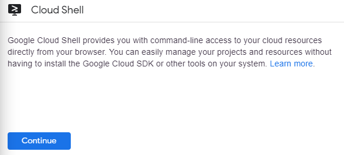

App Engine: Quick Start - Python

Overview
--------

App Engine allows developers to focus on doing what they do best,
writing code. The App Engine standard environment is based on container
instances running on Google's infrastructure. Containers are
preconfigured with one of several available runtimes (Java 7, Java 8,
Python 2.7, Go and PHP). Each runtime also includes libraries that
support [App Engine Standard
APIs](https://cloud.google.com/appengine/docs/about-the-standard-environment#index_of_features).
For many applications, the standard environment runtimes and libraries
might be all you need.

The App Engine standard environment makes it easy to build and deploy an
application that runs reliably even under heavy load and with large
amounts of data. It includes the following features:

-   Persistent storage with queries, sorting, and transactions.
-   Automatic scaling and load balancing.
-   Asynchronous task queues for performing work outside the scope of a
    request.
-   Scheduled tasks for triggering events at specified times or regular
    intervals.
-   Integration with other [Google cloud services and
    APIs](https://cloud.google.com/products/).

Applications run in a secure, sandboxed environment, allowing App Engine
standard environment to distribute requests across multiple servers, and
scaling servers to meet traffic demands. Your application runs within
its own secure, reliable environment that is independent of the
hardware, operating system, or physical location of the server.

This hands-on lab shows you how to create a small App Engine application
that displays a short message.

#### What you'll do

-   Download an application

-   Test the application

-   Deploy the application

#### What you need

To complete this lab, you need:

-   Access to a standard internet browser (Chrome browser recommended).
-   Time to complete the lab.

#### How to start your lab and sign in to the Console

-   Open https://console.cloud.google.com/
-   Enter login credentials

### Activate Google Cloud Shell

Google Cloud Shell is a virtual machine that is loaded with development
tools. It offers a persistent 5GB home directory and runs on the Google
Cloud. Google Cloud Shell provides command-line access to your GCP
resources.

1.  In GCP console, on the top right toolbar, click the Open Cloud Shell
    button.

    

2.  Click **Continue**.
    

It takes a few moments to provision and connect to the environment. When
you are connected, you are already authenticated, and the project is set
to your *PROJECT\_ID*. For example:

**gcloud** is the command-line tool for Google Cloud Platform. It comes
pre-installed on Cloud Shell and supports tab-completion.

You can list the active account name with this command:

    gcloud auth list

Output:

    Credentialed accounts:
     - <myaccount>@<mydomain>.com (active)

Example output:

    Credentialed accounts:
     - google1623327_student@testlabs.net

You can list the project ID with this command:

    gcloud config list project

Output:

    [core]
    project = <project_ID>

Example output:

    [core]
    project = testlabs-gcp-44776a13dea667a6

Full documentation of **gcloud** is available on [Google Cloud gcloud
Overview](https://cloud.google.com/sdk/gcloud).

Enable Google App Engine Admin API
----------------------------------

The App Engine Admin API enables developers to provision and manage
their App Engine Applications.

1.  In the left menu click **APIs & Services** \> **Library**.

2.  Type "App Engine Admin API" in search box.
3.  Click **App Engine Admin API**.

4.  Click Enable.

Download the Hello World app
----------------------------

There is a simple Hello World app for Python you can use to quickly get
a feel for deploying an app to Google Cloud Platform. Follow these steps
to download Hello World to your Google Cloud instance.

1.  Enter the following command to clone the Hello World sample app
    repository to your Google Cloud instance:

<!-- -->

    git clone https://github.com/GoogleCloudPlatform/python-docs-samples

Output:

    Cloning into 'python-docs-samples'...
    remote: Counting objects: 13991, done.
    remote: Compressing objects: 100% (71/71), done.
    remote: Total 13991 (delta 23), reused 56 (delta 18), pack-reused 13891
    Receiving objects: 100% (13991/13991), 3.81 MiB | 0 bytes/s, done.
    Resolving deltas: 100% (7343/7343), done

2.  Go to the directory that contains the sample code:

<!-- -->

    cd python-docs-samples/appengine/standard_python37/hello_world

Test the application
--------------------

Test the application using the Google Cloud development server
(`dev_appserver.py`), which is included with the preinstalled App Engine
SDK.

1.  From within your helloworld directory where the app's
    [app.yaml](https://cloud.google.com/appengine/docs/standard/python/config/appref)
    configuration file is located, start the Google Cloud development
    server with the following command:

<!-- -->

    dev_appserver.py app.yaml

The development server is now running and listening for requests on port
8080.

2.  View the results by clicking the **Web preview** \> **Preview on
    port 8080**.

    

    You'll see this in a new browser window:

    

Make a change
-------------

You can leave the development server running while you develop your
application. The development server watches for changes in your source
files and reloads them if necessary.

Let's try it. Leave the development server running. We'll open another
command line window, then edit `main.py` to change "Hello, World!" to
"Hello, Cruel World!".

1.  Click the **+** next to your Cloud Shell tab to open a new command
    line session.

    

2.  Enter this command to go to the directory that contains the sample
    code.

<!-- -->

    cd python-docs-samples/appengine/standard_python37/hello_world

3.  Enter the following to open main.py in nano to edit the content.

<!-- -->

    nano main.py

4.  Change "Hello, World!" to "Hello, Cruel World!". Exit and save the
    file.

5.  Reload the Hello World! Browser or click the **Web Preview** \>
    **Preview on port 8080** to see the results.

    

Deploy your app
---------------

To deploy your app to App Engine, run the following command from within
the root directory of your application where the app.yaml file is
located:

    gcloud app deploy

You will be prompted to enter where your App engine will be located.

    Please choose the region where you want your App Engine application
    located:

     [1] europe-west2  (supports standard and flexible)
     [2] us-east1      (supports standard and flexible)
     [3] us-east4      (supports standard and flexible)
     [4] asia-northeast1 (supports standard and flexible)
     [5] asia-south1   (supports standard and flexible)
     [6] australia-southeast1 (supports standard and flexible)
     [7] southamerica-east1 (supports standard and flexible)
     [8] us-central    (supports standard and flexible)
     [9] europe-west3  (supports standard and flexible)
     [10] europe-west   (supports standard and flexible)
     [11] cancel
    Please enter your numeric choice:

Enter the number that represents your region. The App Engine application
will then be created.

Example output:

    Creating App Engine application in project [testlabs-gcp-233dca09c0ab577b] and region [asia-south1]....done.
    Services to deploy:

    descriptor:      [/home/gcpstaging8134_student/python-docs-samples/appengine/standard/hello_world/app.yaml]
    source:          [/home/gcpstaging8134_student/python-docs-samples/appengine/standard/hello_world]
    target project:  [testlabs-gcp-233dca09c0ab577b]
    target service:  [default]
    target version:  [20171117t072143]
    target url:      [https://testlabs-gcp-233dca09c0ab577b.appspot.com]

    Do you want to continue (Y/n)?

Enter **Y** when prompted to confirm the details and begin the
deployment of service.

Example output:

    Beginning deployment of service [default]...
    Some files were skipped. Pass `--verbosity=info` to see which ones.
    You may also view the gcloud log file, found at
    [/tmp/tmp.dYC7xGu3oZ/logs/2017.11.17/07.18.27.372768.log].
    ╔════════════════════════════════════════════════════════════╗
    ╠═ Uploading 5 files to Google Cloud Storage                ═╣
    ╚════════════════════════════════════════════════════════════File upload done.
    Updating service [default]...done.
    Waiting for operation [apps/testlabs-gcp-233dca09c0ab577b/operations/2e88ab76-33dc-4aed-93c4-fdd944a95ccf] to complete...done.
    Updating service [default]...done.
    Deployed service [default] to [https://testlabs-gcp-233dca09c0ab577b.appspot.com]

    You can stream logs from the command line by running:
      $ gcloud app logs tail -s default

    To view your application in the web browser run:
      $ gcloud app browse

View your application
---------------------

To launch your browser enter the following command, then click on the
link it provides.

    gcloud app browse

Example output, note that your link will be different:

    Did not detect your browser. Go to this link to view your app:
    https://testlabs-gcp-233dca09c0ab577b.appspot.com

Your application is deployed and you can read the short message in your
browser.

Click **Check my progress** to verify the objective.

Deploy your app.

Test your knowledge
-------------------

Test your knowledge about Google cloud Platform by taking our quiz.
(Please select multiple correct options if necessary.)

Congratulations!
----------------

### Next Steps /Learn More

-   Lean more about an App Engine with [An Overview Of App
    Engine](https://cloud.google.com/appengine/docs/about-the-standard-environment)
-   Try something else with an App Engine with [Getting Started with
    Flask on App Engine Standard
    Environment](https://cloud.google.com/appengine/docs/standard/python/getting-started/python-standard-env)
