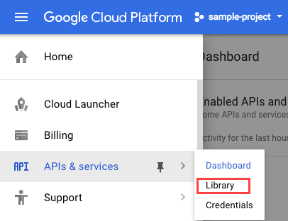
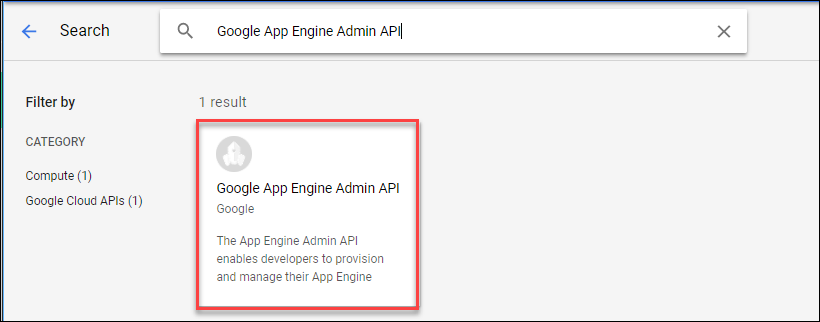
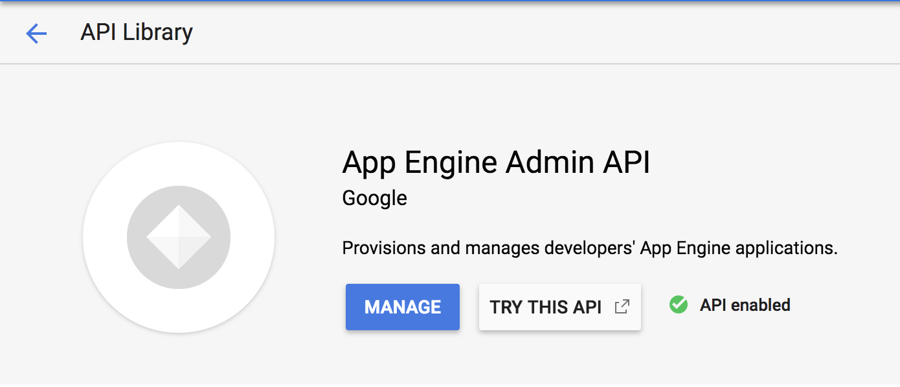
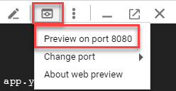
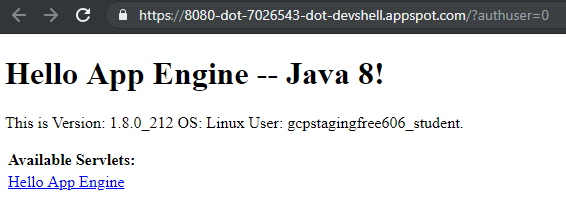

App Engine: Quick Start - Java
=============================

Overview
--------

App Engine allows developers to focus on doing what they do best,
writing code. The App Engine standard environment is based on container
instances running on Google's infrastructure. Containers are
preconfigured with one of several available runtimes (Java 8, Python
3.7, Go and PHP). Each runtime also includes libraries that support [App
Engine Standard
APIs](https://cloud.google.com/appengine/docs/about-the-standard-environment#index_of_features).
For many applications, the standard environment runtimes and libraries
might be all you need.

The App Engine standard environment makes it easy to build and deploy an
application that runs reliably even under heavy load and with large
amounts of data. It includes the following features:

-   Persistent storage with queries, sorting, and transactions.
-   Automatic scaling and load balancing.
-   Asynchronous task queues for performing work outside the scope of a
    request.
-   Scheduled tasks for triggering events at specified times or regular
    intervals.
-   Integration with other [Google cloud services and
    APIs](https://cloud.google.com/products/).

Applications run in a secure, sandboxed environment, allowing App Engine
standard environment to distribute requests across multiple servers, and
scaling servers to meet traffic demands. Your application runs within
its own secure, reliable environment that is independent of the
hardware, operating system, or physical location of the server.

This hands-on lab shows you how to create a small App Engine application
that displays a short message.

### What you'll do

In this lab you will learn how to:

-   Download starter code from a GitHub repository.
-   Run your application locally from a Cloud Shell session.
-   Deploy your application with Google App Engine.

#### What you need

To complete this lab, you need:

-   Access to a standard internet browser (Chrome browser recommended).
-   Time to complete the lab.

#### How to start your lab and sign in to the Console

-   Open https://console.cloud.google.com/
-   Enter login credentials

After a few moments, the GCP console opens in this tab.

**Note:** You can view the menu with a list of GCP Products and Services
by clicking the **Navigation menu** at the top-left, next to “Google
Cloud Platform”. 

### Activate Google Cloud Shell

Google Cloud Shell is a virtual machine that is loaded with development
tools. It offers a persistent 5GB home directory and runs on the Google
Cloud. Google Cloud Shell provides command-line access to your GCP
resources.

1.  In GCP console, on the top right toolbar, click the Open Cloud Shell
    button.

    

2.  Click **Continue**.
    

It takes a few moments to provision and connect to the environment. When
you are connected, you are already authenticated, and the project is set
to your *PROJECT\_ID*. For example:

**gcloud** is the command-line tool for Google Cloud Platform. It comes
pre-installed on Cloud Shell and supports tab-completion.

You can list the active account name with this command:

    gcloud auth list

Output:

    Credentialed accounts:
     - <myaccount>@<mydomain>.com (active)

Example output:

    Credentialed accounts:
     - google1623327_student@testlabs.net

You can list the project ID with this command:

    gcloud config list project

Output:

    [core]
    project = <project_ID>

Example output:

    [core]
    project = testlabs-gcp-44776a13dea667a6

Full documentation of **gcloud** is available on [Google Cloud gcloud
Overview](https://cloud.google.com/sdk/gcloud).

Enable Google App Engine Admin API
----------------------------------

The App Engine Admin API enables developers to provision and manage
their App Engine Applications.

1.  In the left-hand menu click on **APIs & Services** \> **Library**.

2.  Type "App Engine Admin API" in the search box.
3.  Click **App Engine Admin API**.

4.  Click **Enable** if it isn't already set. Your page should now
    resemble the following:

Download the Hello World app
----------------------------

We've created a simple `Hello World` app written in Java so you can
quickly get a feel for deploying an application to the Google Cloud
Platform. Follow these steps to download `Hello World` to your temporary
Google Cloud shell environment.

1.  Open a Cloud Shell session and run the following command to clone
    the Hello World sample app repository:

<!-- -->

    git clone https://github.com/GoogleCloudPlatform/getting-started-java.git

Output:

    Cloning into 'getting-started-java'...
    remote: Enumerating objects: 41, done.
    remote: Counting objects: 100% (41/41), done.
    remote: Compressing objects: 100% (27/27), done.
    remote: Total 7608 (delta 17), reused 23 (delta 14), pack-reused 7567
    Receiving objects: 100% (7608/7608), 50.79 MiB | 24.17 MiB/s, done.
    Resolving deltas: 100% (4166/4166), done.

2.  Then go to the directory that contains the sample code:

<!-- -->

    cd getting-started-java/appengine-standard-java8/helloworld

In this folder you will find the `src` directory that contains a package
called `com.example.appengine.helloworld` that implements a simple HTTP
Servlet.

Test the application using the development server
-------------------------------------------------

To get the development server running, you'll download Maven to manage
compiling your app and starting the development server.

1.  Run the following commands to configure your Maven environment:

<!-- -->

    mvn clean
    mvn package

2.  Enter the following Maven command to download and install Maven and
    run the app:

<!-- -->

    mvn appengine:run

It will take a few minutes for Maven to download and install.

The development server is listening for requests on port 8080 when you
see the following last line of output:

    [INFO] GCLOUD: INFO: Dev App Server is now running

3.  View the app by clicking the **Web preview** button \> **Preview on
    port 8080**:

Your page should resemble the following:

In your terminal window, press `Ctrl+C` to stop the development server.

Deploy your app
---------------

1.  Now you'll create an application on an App Engine with the following
    command:

<!-- -->

    gcloud app create

When prompted, enter your choice of region. You should receive the
following output soon after:

    Success! The app is now created. Please use `gcloud app deploy` to deploy your first app.

2.  Open the `pom.xml` file with the following command:

<!-- -->

    nano pom.xml

3.  Key down towards the bottom of the page until you find this section:

<!-- -->

    <plugins>
      <!-- [START cloudplugin] -->
      <plugin>
        <groupId>com.google.cloud.tools</groupId>
        <artifactId>appengine-maven-plugin</artifactId>
        <version>2.2.0</version>
      </plugin>
      <!-- [END cloudplugin] -->
    </plugins>

4.  Change the version from `2.2.0` to `1.3.1`. Ensure that that section
    resembles the following:

<!-- -->

    <plugins>
      <!-- [START cloudplugin] -->
      <plugin>
        <groupId>com.google.cloud.tools</groupId>
        <artifactId>appengine-maven-plugin</artifactId>
        <version>1.3.1</version>
      </plugin>
      <!-- [END cloudplugin] -->
    </plugins>

5.  Now exit nano and save the file with **CTRL** + **X** --\> **Y**
    --\> **Enter**.

6.  **DO NOT** use the `gcloud app deploy` command as stated in the
    output to deploy your app. Instead, run the following command to
    deploy your application:

<!-- -->

    mvn package appengine:deploy

You should receive the following output:

    -------------------------------------------------------------------------------
    [INFO] BUILD SUCCESS
    [INFO] ------------------------------------------------------------------------
    [INFO] Total time:  38.848 s
    [INFO] Finished at: 2019-01-15T17:42:49-08:00
    [INFO] ------------------------------------------------------------------------

View your application
---------------------

To launch your browser, enter the following command then click on the
link it provides.

    gcloud app browse

Example output; your link will be different:

    Did not detect your browser. Go to this link to view your app:
    https://testlabs-gcp-5c823ee0b4c7fa19.appspot.com

Your application is deployed and you can read the short message in your
browser:

Click **Check my progress** to verify the objective.

Deploy your app.

### Next Steps /Learn More

-   Lean more about an App Engine with [An Overview Of App
    Engine](https://cloud.google.com/appengine/docs/about-the-standard-environment)
-   Try something else with an App Engine with [Getting Started with
    Flask on App Engine Standard
    Environment](https://cloud.google.com/appengine/docs/standard/python/getting-started/python-standard-env)
