Introduction to SQL for BigQuery and Cloud SQL
==============================================

Overview
--------

SQL (Structured Query Language) is a standard language for data
operations that allows you to ask questions and get insights from
structured datasets. It's commonly used in database management and
allows you to perform tasks like transaction record writing into
relational databases and petabyte-scale data analysis.

This lab is divided into two parts: in the first half, you will learn
fundamental SQL querying keywords, which you will run in the BigQuery
console on a public dataset that contains information on London
bikeshares.

In the second half, you will learn how to export subsets of the London
bikeshare dataset into CSV files, which you will then upload to Cloud
SQL. From there you will learn how to use Cloud SQL to create and manage
databases and tables. Towards the end, you will get hands-on practice
with additional SQL keywords that manipulate and edit data.

### Objectives

In this lab, you will learn how to:

-   Distinguish databases from tables and projects.
-   Use the `SELECT`, `FROM`, and `WHERE` keywords to construct simple
    queries.
-   Identify the different components and hierarchies within the
    BigQuery console.
-   Load databases and tables into BigQuery.
-   Execute simple queries on tables.
-   Learn about the `COUNT`, `GROUP BY`, `AS`, and `ORDER BY` keywords.
-   Execute and chain the above commands to pull meaningful data from
    datasets.
-   Export a subset of data into a CSV file and store that file into a
    new Cloud Storage bucket.
-   Create a new Cloud SQL instance and load your exported CSV file as a
    new table.
-   Run `CREATE DATABASE`, `CREATE TABLE`, `DELETE`, `INSERT INTO`, and
    `UNION` queries in Cloud SQL.

### Prerequisites

**Important:** Before starting this lab, log out of your personal gmail
account.

This is a **introductory level** lab. This assumes little to no prior
experience with SQL. Familiarity with Cloud Storage and Cloud Shell is
recommended, but not required. This lab will teach you the basics of
reading and writing queries in SQL, which you will apply by using
BigQuery and Cloud SQL.

Setup and Requirements
----------------------

#### What you need

To complete this lab, you need:

-   Access to a standard internet browser (Chrome browser recommended).
-   Time to complete the lab.

### **Google Cloud Platform Console**

#### How to start your lab and sign in to the Console

-   Open https://console.cloud.google.com/
-   Enter login credentials

After a few moments, the GCP console opens in this tab.

**Note:** You can view the menu with a list of GCP Products and Services
by clicking the **Navigation menu** at the top-left, next to “Google
Cloud Platform”. 

The Basics of SQL
-----------------

### Databases and Tables

As mentioned earlier, SQL allows you to get information from "structured
datasets". Structured datasets have clear rules and formatting and often
times are organized into tables, or data that's formatted in rows and
columns.

An example of *unstructured data* would be an image file. Unstructured
data is inoperable with SQL and cannot be stored in BigQuery datasets or
tables (at least natively.) To work with image data (for instance), you
would use a service like Cloud Vision.

The following is an example of a structured dataset—a simple table:

+--------------------------+--------------------------+--------------------------+
| **User**                 | **Price**                | **Shipped**              |
+--------------------------+--------------------------+--------------------------+
| Sean                     | \$35                     | Yes                      |
+--------------------------+--------------------------+--------------------------+
| Rocky                    | \$50                     | No                       |
+--------------------------+--------------------------+--------------------------+

If you've had experience with Google Sheets, then the above should look
quite similar. As we see, the table has columns for User, Price, and
Shipped and two rows that are composed of filled in column values.

A Database is essentially a *collection of one or more tables*. SQL is a
structured database management tool, but quite often (and in this lab)
you will be running queries on one or a few tables joined together—not
on whole databases.

### SELECT and FROM

SQL is phonetic by nature and before running a query, it's always
helpful to first figure out what question you want to ask your data
(unless you're just exploring for fun.)

SQL has predefined *keywords* which you use to translate your question
into the pseudo-english SQL syntax so you can get the database engine to
return the answer you want.

The most essential keywords are `SELECT` and `FROM`:

-   Use `SELECT` to specify what fields you want to pull from your
    dataset.
-   Use `FROM` to specify what table or tables we want to pull our data
    from.

An example may help understanding. Assume that we have the following
table `example_table`, which has columns USER, PRICE, and SHIPPED:

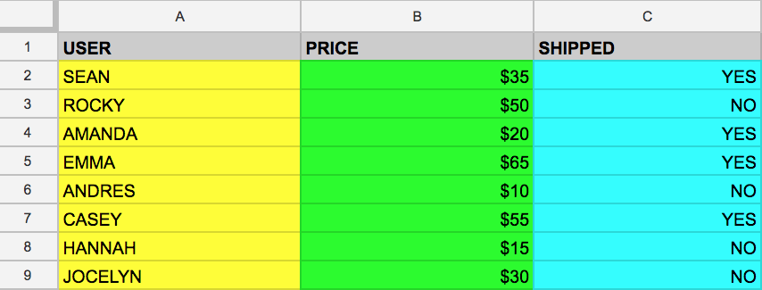

And let's say that we want to just pull the data that's found in the
USER column. We can do this by running the following query that uses
`SELECT` and `FROM`:

    SELECT USER FROM example_table

If we executed the above command, we would select all the names from the
`USER` column that are found in `example_table`.

You can also select multiple columns with the SQL `SELECT` keyword. Say
that you want to pull the data that's found in the USER and SHIPPED
columns. To do this, modify the previous query by adding another column
value to our `SELECT` query (making sure it's separated by a comma!):

    SELECT USER, SHIPPED FROM example_table

Running the above retrieves the `USER` and the `SHIPPED` data from
memory:

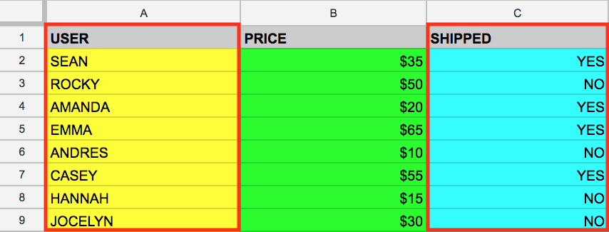

And just like that you've covered two fundamental SQL keywords! Now to
make things a bit more interesting.

### WHERE

The `WHERE` keyword is another SQL command that filters tables for
specific column values. Say that you want to pull the names from
`example_table` whose packages were shipped. You can supplement the
query with a `WHERE`, like the following:

    SELECT USER FROM example_table WHERE SHIPPED='YES'

Running the above returns all USERs whose packages have been SHIPPED to
from memory:

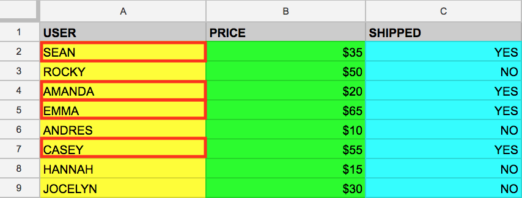

Now that you have a baseline understanding of SQL's core keywords, apply
what you've learned by running these types of queries in the BigQuery
console.

### Test your understanding

The following are some multiple choice questions to reinforce your
understanding of the concepts we've covered so far. Answer them to the
best of your abilities.

Exploring the BigQuery Console
------------------------------

### The BigQuery paradigm

[BigQuery](https://cloud.google.com/bigquery/) is a fully-managed
petabyte-scale data warehouse that runs on the Google Cloud Platform.
Data analysts and data scientists can quickly query and filter large
datasets, aggregate results, and perform complex operations without
having to worry about setting up and managing servers. It comes in the
form of a command line tool (preinstalled in cloudshell) or a web
console—both ready for managing and querying data housed in GCP
projects.

In this lab, you use the web console to run SQL queries.

### Open BigQuery Console

In the Google Cloud Console, select **Navigation menu** \> **BigQuery**:

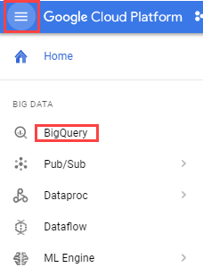

The **Welcome to BigQuery in the Cloud Console** message box opens. This
message box provides a link to the quickstart guide and the release
notes.

Click **Done**.

The BigQuery console opens.

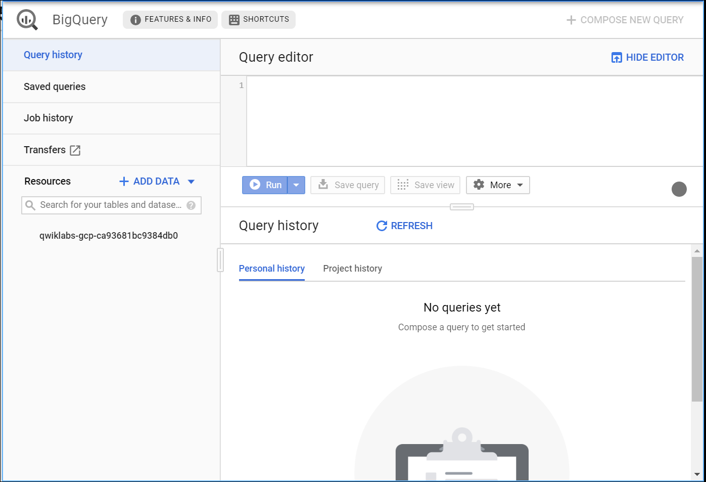

Take a moment to note some important features of the UI. The right-hand
side of the console houses the "Query editor". This is where you write
and run SQL commands like the examples we covered earlier. Below that is
"Query history", which is a list of queries you ran previously.

The left pane of the console is the "Navigation panel". Apart from the
self-explanatory query history, saved queries, and job history, there is
the *Resources* tab.

The highest level of resources contain GCP projects, which are just like
the temporary GCP projects you sign in to and use with each Qwiklab. As
you can see in your console and in the last screenshot, we only have our
Qwiklabs project housed in the Resources tab. If you try clicking on the
arrow next the project name, nothing will show up.

This is because your project doesn't contain any datasets or tables, you
have nothing that can be queried. Earlier you learned datasets contain
tables. When you add data to your project, note that in BigQuery,
*projects contain datasets, and datasets contain tables*. Now that you
better understand the project → dataset → table paradigm and the
intricacies of the console, you can load up some queryable data.

### Uploading queryable data

In this section you pull in some public data into your project so you
can practice running SQL commands in BigQuery.

Click on the **+ ADD DATA** link then select **Explore public
datasets**:

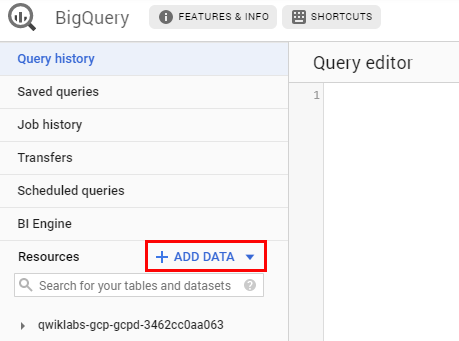

In the search bar, enter "london", then select the **London Bicycle
Hires** tile, then **View Dataset**.

A new tab tab will open, and you will now have a new project called
`bigquery-public-data` added to the Resources panel:

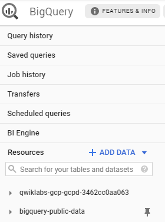

It's important to note that you are still working out of your Qwiklabs
project in this new tab. All you did was pull a publicly accessible
project that contains datasets and tables into BigQuery for analysis —
you didn't *switch over* to that project. All of your jobs and services
are still tied to your Qwiklabs account. You can see this for yourself
by inspecting the project field near the top of the console:

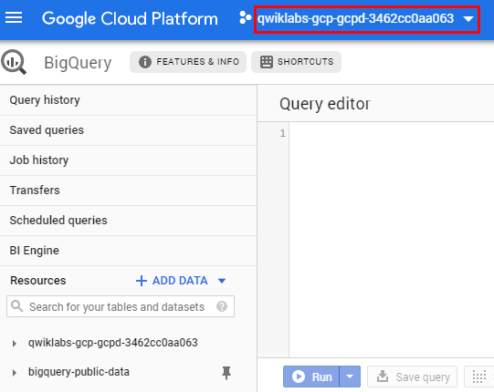

Click on **bigquery-public-data** \> **london\_bicycles** \>
**cycle\_hire**. You now have data that follows the BigQuery paradigm:

-   GCP Project → `bigquery-public-data`
-   Dataset → `london_bicycles`
-   Table → `cycle_hire`

Now that you are in the `cycle_hire` table, in the center of the console
click the **Preview** tab. Your page should resemble the following:

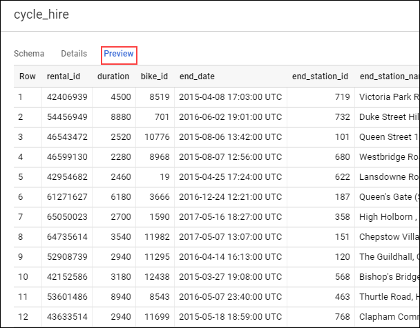

Inspect the columns and values populated in the rows. You are now ready
to run some SQL queries on the `cycle_hire` table.

### Running SELECT, FROM, and WHERE in BigQuery

You now have a basic understanding of SQL querying keywords and the
BigQuery data paradigm and some data to work with. Run some SQL commands
using this GCP service.

If you look at the bottom right corner of the console, you will notice
that there are **24,369,201** rows of data, or individual bikeshare
trips taken in London between 2015 and 2017 (not a small amount by any
means!)

Now take note of the seventh column key: `end_station_name`, which
specifies the end destination of bikeshare rides. Before we get too
deep, let's first run a simple query to isolate the `end_station_name`
column. Copy and paste the following command in to the Query editor:

    SELECT end_station_name FROM `bigquery-public-data.london_bicycles.cycle_hire`;

Then click **Run**.

After \~20 seconds, you should be returned with 24369201 rows that
contain the single column you queried for: `end_station_name`.

Why don't you find out how many bike trips were 20 minutes or longer?

Click **COMPOSE NEW QUERY** to clear the Query editor, then run the
following query that utilizes the `WHERE` keyword:

    SELECT * FROM `bigquery-public-data.london_bicycles.cycle_hire` WHERE duration>=1200;

This query may take a minute or so to run.

`SELECT *` returns all column values from the table. Duration is
measured in seconds, which is why you used the value 1200 (60 \* 20).

If you look in the bottom right corner you see that **7,334,890** rows
were returned. As a fraction of the total (7334890/24369201), this means
that \~30% of London bikeshare rides lasted 20 minutes or longer
(they're in it for the long haul!)

### Test your understanding

The following are some multiple choice questions to reinforce your
understanding of the concepts we've covered so far. Answer them to the
best of your abilities.

More SQL Keywords: GROUP BY, COUNT, AS, and ORDER BY
----------------------------------------------------

### GROUP BY

The `GROUP BY` keyword will aggregate result-set rows that share common
criteria (e.g. a column value) and will return all of the unique entries
found for such criteria.

This is a useful keyword for figuring out categorical information on
tables. To get a better picture of what this keyword does, click
**COMPOSE NEW QUERY**, then copy and paste the following command in the
Query editor:

    SELECT start_station_name FROM `bigquery-public-data.london_bicycles.cycle_hire` GROUP BY start_station_name;

Click **Run**.

You should receive a similar output (row values may not match the
following):

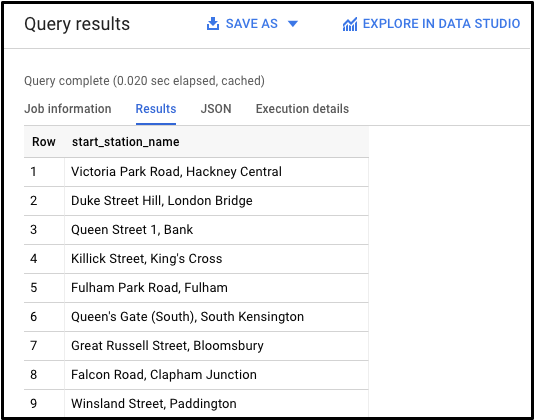

Without the `GROUP BY`, the query would have returned the full
**24,369,201** rows. `GROUP BY` will output the unique (non-duplicate)
column values found in the table. You can see this for yourself by
looking in the bottom right corner. You will see **880** rows, meaning
there are 880 distinct London bikeshare starting points.

### COUNT

The `COUNT()` function will return the number of rows that share the
same criteria (e.g. column value). This can be very useful in tandem
with a `GROUP BY`.

Add the `COUNT` function to our previous query to figure out how many
rides begin in each starting point. Click **COMPOSE NEW QUERY**, copy
and paste the following command in to the Query editor and then click
**Run query**:

    SELECT start_station_name, COUNT(*) FROM `bigquery-public-data.london_bicycles.cycle_hire` GROUP BY start_station_name;

You should receive a similar output (row values may not match the
following):

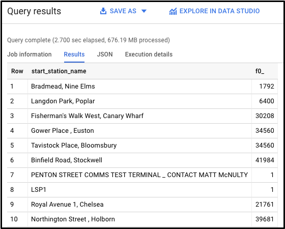

This shows how many bikeshare rides begin at each starting location.

### AS

SQL also has an `AS` keyword, which creates an *alias* of a table or
column. An alias is a new name that's given to the returned column or
table—whatever `AS` specifies.

Add an `AS` keyword to the last query we ran to see this in action.
Click **COMPOSE NEW QUERY**, then copy and paste the following command
in to the Query editor:

    SELECT start_station_name, COUNT(*) AS num_starts FROM `bigquery-public-data.london_bicycles.cycle_hire` GROUP BY start_station_name;

Click **Run**.

You should receive a similar output (be aware that the row values might
not be identical):

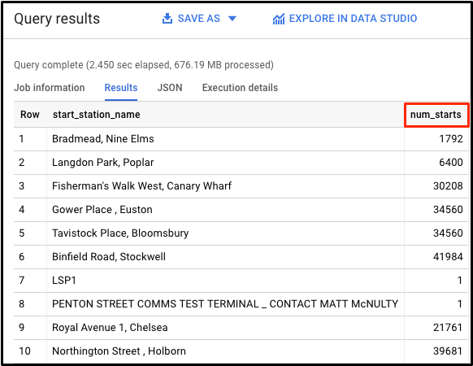

As we see, the `COUNT(*)` column in the returned table is now set to the
alias name `num_starts`. This is a handy keyword to use especially if
you are dealing with large sets of data—forgetting what an ambiguous
table or column name specifies happens more often than you think!

### ORDER BY

The `ORDER BY` keyword sorts the returned data from a query in ascending
or descending order based on a specified criteria or column value. We
will add this keyword to our previous query to do the following:

-   Return a table that contains the number of bikeshare rides that
    begin in each starting station, organized alphabetically by the
    starting station.
-   Return a table that contains the number of bikeshare rides that
    begin in each starting station, organized numerically from lowest to
    highest.
-   Return a table that contains the number of bikeshare rides that
    begin in each starting station, organized numerically from highest
    to lowest.

Each of the commands below is a separate query. For each command, clear
the Query editor, copy and paste the command in to the Query editor, and
then click **Run**. Examine the results.

    SELECT start_station_name, COUNT(*) AS num FROM `bigquery-public-data.london_bicycles.cycle_hire` GROUP BY start_station_name ORDER BY start_station_name;

    SELECT start_station_name, COUNT(*) AS num FROM `bigquery-public-data.london_bicycles.cycle_hire` GROUP BY start_station_name ORDER BY num;

    SELECT start_station_name, COUNT(*) AS num FROM `bigquery-public-data.london_bicycles.cycle_hire` GROUP BY start_station_name ORDER BY num DESC;

The last query should have returned the following:

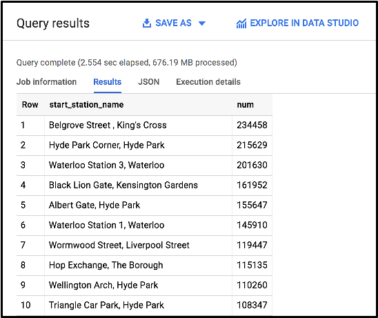

We see that "Belgrove Street, King's Cross" has the highest number of
starts. However, as a fraction of the total (234458/24369201), we see
that \< 1% of rides start from this station.

### Test your understanding

The following are some multiple choice questions to reinforce your
understanding of the concepts we've covered so far. Answer them to the
best of your abilities.

Working with Cloud SQL
----------------------

### Exporting queries as CSV files

[Cloud SQL](https://cloud.google.com/sql/) is a fully-managed database
service that makes it easy to set up, maintain, manage, and administer
your relational PostgreSQL and MySQL databases in the cloud. There are
two formats of data accepted by Cloud SQL: dump files (.sql) or CSV
files (.csv). You will learn how to export subsets of the `cycle_hire`
table into CSV files and upload them to Cloud Storage as an intermediate
location.

Back in the BigQuery Console, this should have been the last command
that you ran:

    SELECT start_station_name, COUNT(*) AS num FROM `bigquery-public-data.london_bicycles.cycle_hire` GROUP BY start_station_name ORDER BY num DESC;

In the Query Results section click **SAVE RESULTS** \> **CSV(local
file)**. This initiates a download, which saves this query as a CSV
file. Note the location and the name of this downloaded file—you will
need it soon.

Click **COMPOSE NEW QUERY**, then copy and run the following in the
query editor:

    SELECT end_station_name, COUNT(*) AS num FROM `bigquery-public-data.london_bicycles.cycle_hire` GROUP BY end_station_name ORDER BY num DESC;

This will return a table that contains the number of bikeshare rides
that finish in each ending station and is organized numerically from
highest to lowest number of rides. You should receive the following
output:

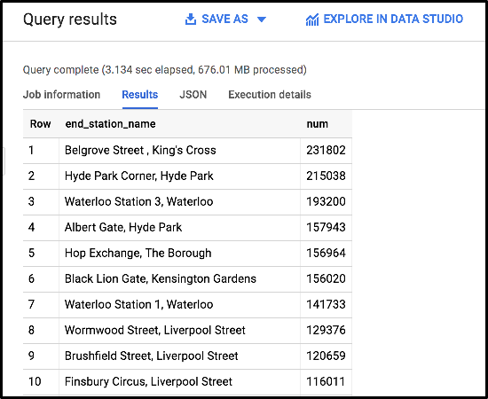

In the Query Results section click **SAVE RESULTS** \> **CSV**. This
initiates a download, which saves this query as a CSV file. Note the
location and the name of this downloaded file—you will need it in the
following section.

### Upload CSV files to Cloud Storage

Go to the GCP Console where you'll create a storage bucket where you can
upload the files you just created.

Select **Navigation menu** \> **Storage** \> **Browser**, and then click
**Create bucket**.

Enter a unique name for your bucket, keep all other settings, and hit
**Create**:

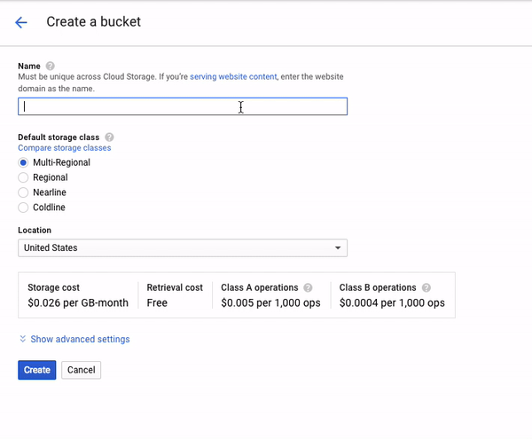

### Test Completed Task

Click **Check my progress** below to check your lab progress. If you
successfully created your bucket, you'll see an assessment score.

Create a cloud storage bucket.

You should now be in the GCP Console looking at your newly created Cloud
Storage Bucket.

Click **Upload files** and select the CSV that contains
`start_station_name` data. Then click **Open**. Repeat this for the
`end_station_name` data.

Rename your `start_station_name` file by clicking on the three dots next
to on the far side of the file and click **rename**. Rename the file
`start_station_data.csv`.

Rename your `end_station_name` file by clicking on the three dots next
to on the far side of the file and click **rename**. Rename the file
`end_station_data.csv`.

Your bucket should now resemble the following:

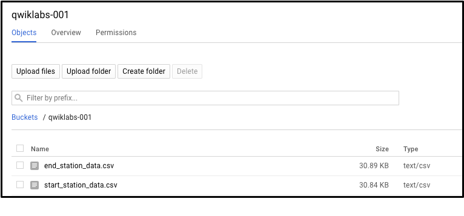

### Test Completed Task

Click **Check my progress** to verify your performed task. If you have
successfully upload CSV objects to your bucket, you will see an
assessment score.

Upload CSV files to Cloud Storage.

### Create a Cloud SQL instance

In the console, select **Navigation menu** \> **SQL**.

Click **Create Instance**.

From here, you will be prompted to choose a database engine. Select
**MySQL**.

Now enter in a name for your instance (like "testlabs-demo") and enter
in a secure password in the **Root password** field (remember it!), then
click **Create**:

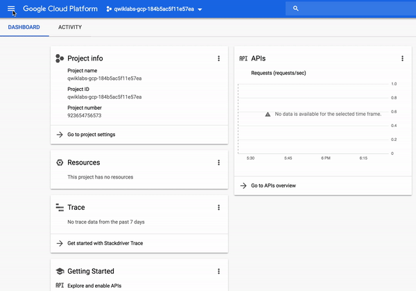

It might take a few minutes for the instance to be created. Once it is,
you will see a green checkmark next to the instance name.

Click on the Cloud SQL instance. You should now be on a page that
resembles the following:

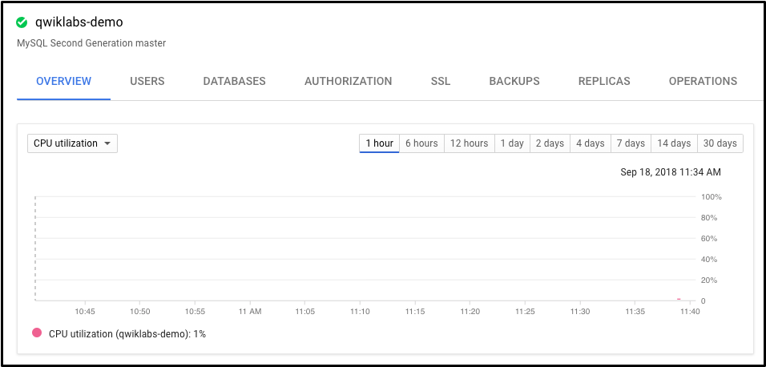

### Test Completed Task

To check out your lab progress, click **Check my progress** below.If you
have successfully set up your Cloud SQL instance, you will see an
assessment score.

Create a CloudSQL Instance.

New Queries in Cloud SQL
------------------------

### CREATE keyword (databases and tables)

Now that you have a Cloud SQL instance up and running, create a database
inside of it using the Cloud Shell Command Line.

### Activate Google Cloud Shell

Google Cloud Shell is a virtual machine that is loaded with development
tools. It offers a persistent 5GB home directory and runs on the Google
Cloud. Google Cloud Shell provides command-line access to your GCP
resources.

1.  In GCP console, on the top right toolbar, click the Open Cloud Shell
    button.

    

2.  Click **Continue**.
    

It takes a few moments to provision and connect to the environment. When
you are connected, you are already authenticated, and the project is set
to your *PROJECT\_ID*. For example:

**gcloud** is the command-line tool for Google Cloud Platform. It comes
pre-installed on Cloud Shell and supports tab-completion.

You can list the active account name with this command:

    gcloud auth list

Output:

    Credentialed accounts:
     - <myaccount>@<mydomain>.com (active)

Example output:

    Credentialed accounts:
     - google1623327_student@testlabs.net

You can list the project ID with this command:

    gcloud config list project

Output:

    [core]
    project = <project_ID>

Example output:

    [core]
    project = testlabs-gcp-44776a13dea667a6

Full documentation of **gcloud** is available on [Google Cloud gcloud
Overview](https://cloud.google.com/sdk/gcloud).

Run the following command in Cloud Shell to connect to your SQL
instance, replacing `testlabs-demo` if you used a different name for
your instance:

    gcloud sql connect  testlabs-demo --user=root

It may take a minute to connect to your instance.

When prompted, enter the root password you set for the instance.

You should now be on a similar output:

    Welcome to the MariaDB monitor.  Commands end with ; or \g.
    Your MySQL connection id is 494
    Server version: 5.7.14-google-log (Google)

    Copyright (c) 2000, 2017, Oracle, MariaDB Corporation Ab and others.

    Type 'help;' or '\h' for help. Type '\c' to clear the current input statement.

    MySQL [(none)]>

A Cloud SQL instance comes with pre-configured databases, but you will
create your own to store the London bikeshare data.

Run the following command at the MySQL server prompt to create a
database called `bike`:

    CREATE DATABASE bike;

You should receive the following output:

    Query OK, 1 row affected (0.05 sec)

    MySQL [(none)]>

### Test Completed Task

Check your progress by clicking **Check my progress** to verify your
performed task. If you have successfully created database in Cloud SQL
instance, you will see an assessment score.

Create a database.

Make a table inside of the bike database by running the following
command:

    USE bike;
    CREATE TABLE london1 (start_station_name VARCHAR(255), num INT);

This statement uses the `CREATE` keyword, but this time it uses the
`TABLE` clause to specify that it wants to build a table instead of a
database. The `USE` keyword specifies a database that you want to
connect to. You now have a table named "london1" that contains two
columns, "start\_station\_name" and "num". `VARCHAR(255)` specifies
variable length string column that can hold up to 255 characters and
`INT` is a column of type integer.

Create another table named "london2" by running the following command:

    USE bike;
    CREATE TABLE london2 (end_station_name VARCHAR(255), num INT);

Now confirm that your empty tables were created. Run the following
commands at the MySQL server prompt:

    SELECT * FROM london1;
    SELECT * FROM london2;

You should receive the following output for both commands:

    Empty set (0.04 sec)

It says "empty set" because you haven't loaded in any data yet.

### Upload CSV files to tables

Return to the Cloud SQL console. You will now upload the
`start_station_name` and `end_station_name` CSV files into your newly
created london1 and london2 tables.

1.  In your Cloud SQL instance page, click **IMPORT**.
2.  In the Cloud Storage file field, click **Browse**, and then click
    the arrow opposite your bucket name, and then click
    `start_station_data.csv`. Click **Select**.
3.  Select the `bike` database and type in "london1" as your table.
4.  Click **Import**:

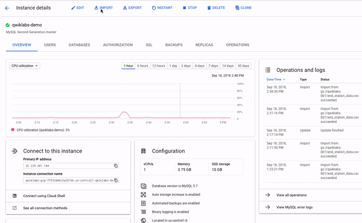

Do the same for the other CSV file.

1.  In your Cloud SQL instance page, click **IMPORT**.
2.  In the Cloud Storage file field, click **Browse**, and then click
    the arrow opposite your bucket name, and then click
    `end_station_data.csv` Click **Select**.
3.  Select the bike database and type in "london2" as your table.
4.  Click **Import**:

You should now have both CSV files uploaded to tables in the `bike`
database.

Return to your Cloud Shell session and run the following command at the
MySQL server prompt to inspect the contents of london1:

    SELECT * FROM london1;

You should receive 881 lines of output, one more each unique station
name. Your output be formatted like this:

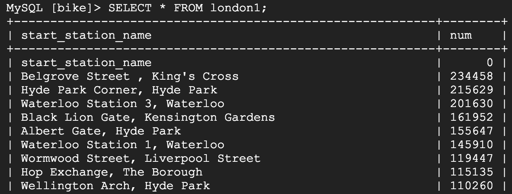

Run the following command to make sure that london2 has been populated:

    SELECT * FROM london2;

You should receive 883 lines of output, one more each unique station
name. Your output be formatted like this:

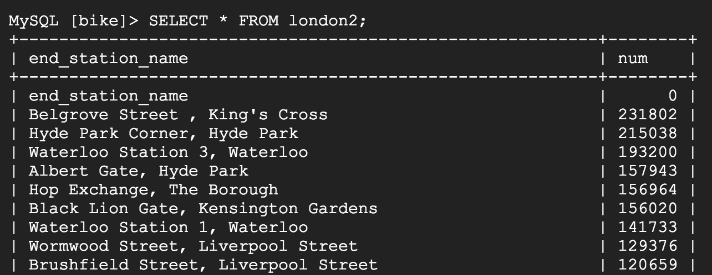

### DELETE keyword

Here are a couple more SQL keywords that help us with data management.
The first is the `DELETE` keyword.

Run the following commands in your MySQL session to delete the first row
of the london1 and london2:

    DELETE FROM london1 WHERE num=0;
    DELETE FROM london2 WHERE num=0;

You should receive the following output after running both commands:

    Query OK, 1 row affected (0.04 sec)

The rows deleted were the column headers from the CSV files. The
`DELETE` keyword will not remove the first row of the file per se, but
all *rows* of the table where the column name (in this case "num")
contains a specified value (in this case "0"). If you run the
`SELECT * FROM london1;` and `SELECT * FROM london2;` queries and scroll
to the top of the table, you will see that those rows no longer exist.

### INSERT INTO keyword

You can also insert values into tables with the `INSERT INTO` keyword.
Run the following command to insert a new row into london1, which sets
`start_station_name` to "test destination" and `num` to "1":

    INSERT INTO london1 (start_station_name, num) VALUES ("test destination", 1);

The `INSERT INTO` keyword requires a table (london1) and will create a
new row with columns specified by the terms in the first parenthesis (in
this case "start\_station\_name" and "num"). Whatever comes after the
"VALUES" clause will be inserted as values in the new row.

You should receive the following output:

    Query OK, 1 row affected (0.05 sec)

If you run the query `SELECT * FROM london1;` you will see an additional
row added at the bottom of the "london1" table:

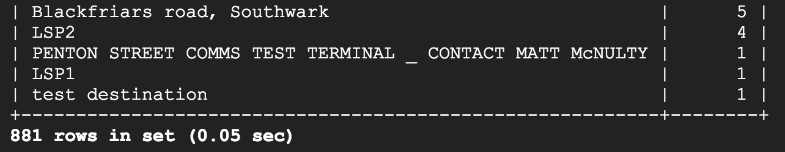

### UNION keyword

The last SQL keyword that you'll learn about is `UNION`. This keyword
combines the output of two or more `SELECT` queries into a result-set.
You use `UNION` to combine subsets of the "london1" and "london2"
tables.

The following chained query pulls specific data from both tables and
combine them with the `UNION` operator.

Run the following command at the MySQL server prompt:

    SELECT start_station_name AS top_stations, num FROM london1 WHERE num>100000
    UNION
    SELECT end_station_name, num FROM london2 WHERE num>100000
    ORDER BY top_stations DESC;

The first `SELECT` query selects the two columns from the "london1"
table and creates an alias for "start\_station\_name", which gets set to
"top\_stations". It uses the `WHERE` keyword to only pull rideshare
station names where over 100,000 bikes start their journey.

The second `SELECT` query selects the two columns from the "london2"
table and uses the `WHERE` keyword to only pull rideshare station names
where over 100,000 bikes end their journey.

The `UNION` keyword in between combines the output of these queries by
assimilating the "london2" data with "london1". Since "london1" is being
unioned with "london2", the column values that take precedent are
"top\_stations" and "num".

`ORDER BY` will order the final, unioned table by the "top\_stations"
column value alphabetically and in descending order.

You should receive the following output:

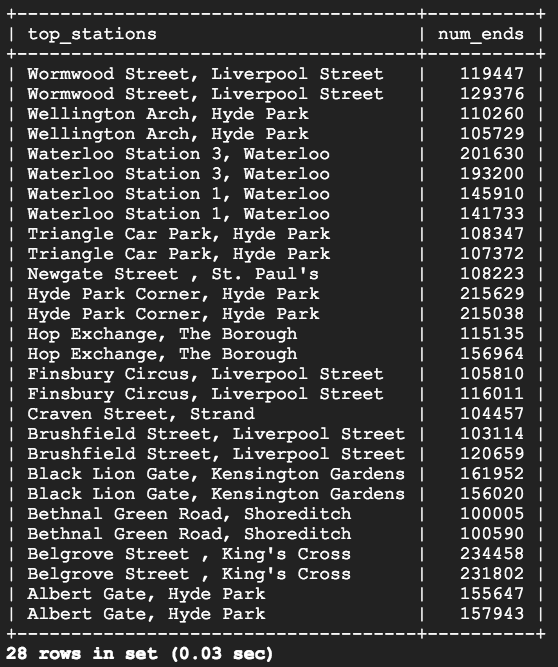

As you see, 13/14 stations share the top spots for rideshare starting
and ending points. With some basic SQL keywords you were able to query a
sizable dataset, which returned data points and answers to specific
questions.

Congratulations!
----------------

In this lab you learned the fundamentals of SQL and how you can apply
keywords and run queries in BigQuery and CloudSQL. You were taught the
core concepts behind projects, databases, and tables. You practiced with
keywords that manipulated and edited data. You learned how to load
datasets into BigQuery and you practiced running queries on tables. You
learned how to create instances in Cloud SQL and practiced transferring
subsets of data into tables contained in databases. You chained and ran
queries in Cloud SQL to arrive at some interesting conclusions about
London bikesharing starting and ending stations.

